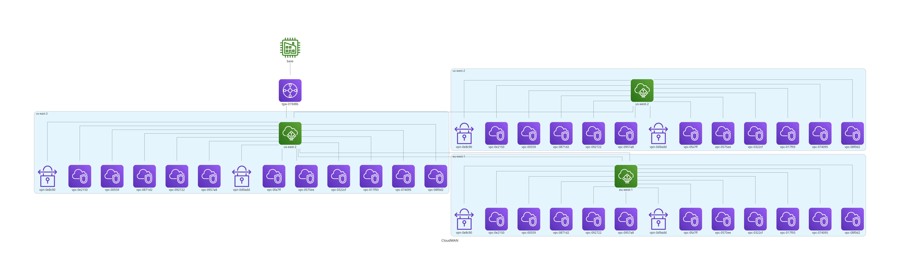

# AWS CloudWAN Network Diagram as Code  

## Overview  
This project leverages **Python Diagrams** to **generate automated, code-driven network diagrams** for complex AWS CloudWAN architectures. It aims to solve the challenge of documenting multi-region, multi-segment cloud networks by providing **repeatable, maintainable, and version-controlled** network visualizations.  

## Why This Project?  
Many network and cloud architects struggle to document **multi-dimensional** cloud network architectures—especially at scale. This repository demonstrates:  
- **Programmatic diagram generation** to avoid manual updates.  
- **Granular, focused views** of different network layers.  
- **Git integration** for version control, ensuring diagrams stay in sync with network changes.  
- **Modular design**, allowing expansion as network complexity grows.  

## Architecture & Components  
This repository models a **multi-region AWS CloudWAN deployment**, including:  
- **AWS CloudWAN Core Network**  
- **Regional VPCs**
- **Transit Gateway (TGW) & VPC Peering**
- **VPN & Hybrid Connectivity**

### **Diagram Example**  
*The generated diagrams provide clear visualizations of network connectivity, making it easier for architects, engineers, and security teams to understand relationships and dependencies.*  

  

## Getting Started  

### **Clone the Repository**  
```sh
git clone https://github.com/jameslazo/jamf--devops-engineer-application.git
cd aws-cloudwan-diagram